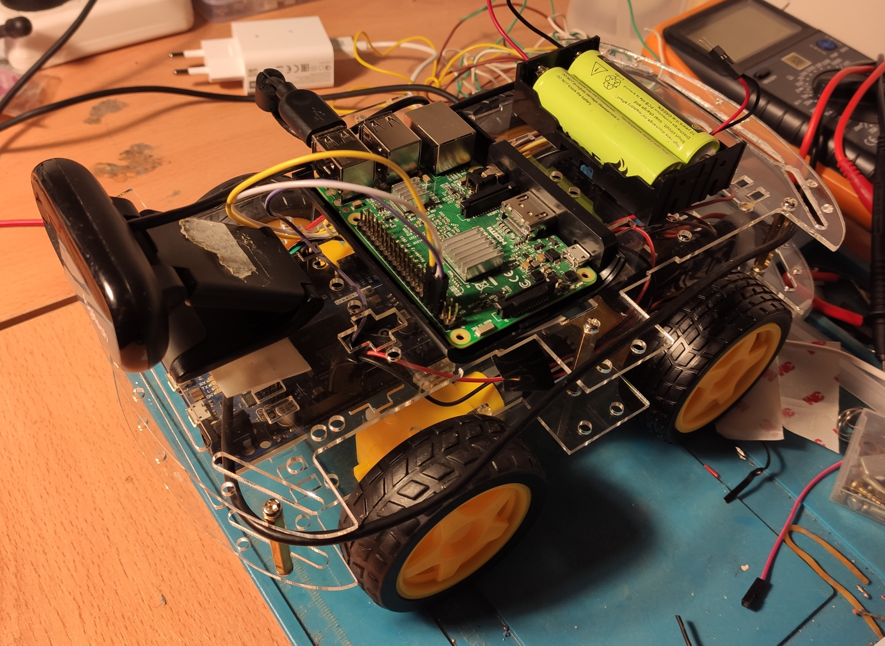

# rovervision

## Overview

ROS video view with AI pipeline for rover control. This project is related to:

- [roverbridge](https://github.com/nhorro/roverbridge)
- [roverstation](https://github.com/nhorro/roverstation)

and:

- [rover-firmware](https://github.com/nhorro/rover-firmware)

**Keywords:** rover, ros, raspberrypi, arduino, opencv.



### Building from Source

#### Dependencies

- [Robot Operating System (ROS)](http://wiki.ros.org) (middleware for robotics).

#### Building

To build from source, clone the latest version from this repository into your catkin workspace and compile the package using:
```bash
cd catkin_workspace/src
git clone (https://github.com/nhorro/rovervision)
cd ../
rosdep install --from-paths . --ignore-src
catkin_make
```

## Usage

Rover must be executing roverbridge.

```bash
export ROS_IP="RASPBERRY_PI_IP" 
export ROS_MASTER_URI="http://LAPTOP_IP:11311"
roslaunch rovervision video.launch 
```

## Launch files

* **rovervision.launch:** Launch teleop control and minimal camera view.

## Nodes

### roverteleop

Control vehicle through keyboard.

#### Subscribed Topics

#### Published Topics


# WIP

Tensorflow models.
Para debuggear ejecutar usb_cam en host
